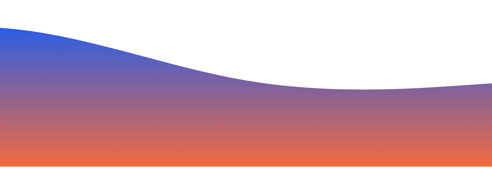
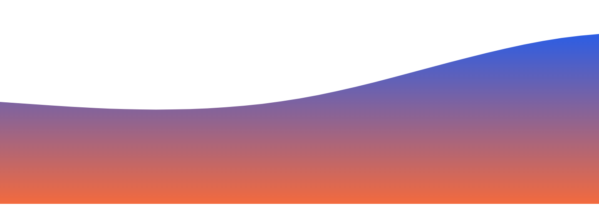

	

# Hi there 👋

I love coding in Python :snake: and C++. I am currently an intern at [Bank of America](https://www.linkedin.com/in/manabkb/details/experience/) and also a [Microsoft Learn Student Ambassador](https://studentambassadors.microsoft.com/en-US/profile/157076). I regularly (try to) participate in hackathons, coding contests and practice problem solving on websites such as - [Hackerrank](https://www.hackerrank.com/mkbiswas_784), Leetcode, etc.

### ⚡ Fun fact:

- 🔭 I’m currently working on a Deep Learning model.
- 🌱 I’m currently building up my basics in Deep Learning.
- ⚡ I love playing the piano and console games.
- :pencil2: I Write [blogs](https://marvelous-khapse-869e73.netlify.app/blog/) on free days.
- :musical_note: I love to listen to EDM's and Dubstep Music.

 ### 🧰 Languages:

- Python (Intermediate)         
- C++ (Intermediate)
- C (Intermediate-Advanced)
- Kotlin (Basic-Intermediate)
- MERN Stack (Intermediate)

### Let's Connect :coffee:

	
	
	  
	
	

